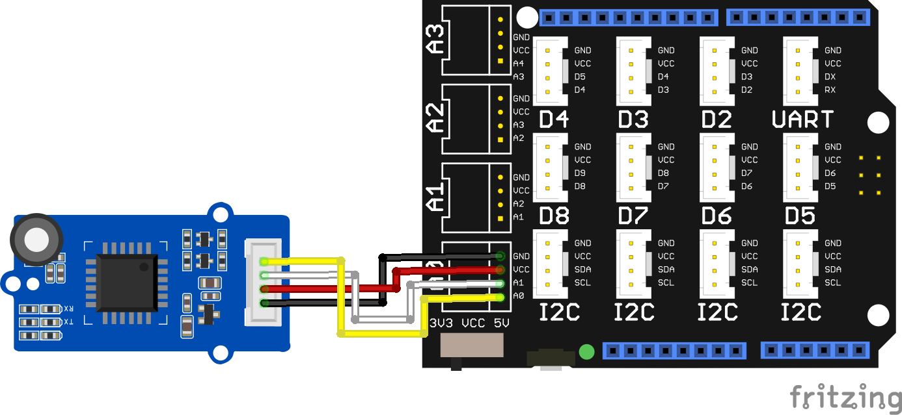

### Communication entre 2 cartes STM32WB55 avec des modules LoraE5

## Une partie émetteur et une partie récepteur

**Pour la partie émetteur** : 

On utilise la librairie **SoftwareSerial** pour ouvrir une 2ème com série. 
on utilise les boutons de la STM32WB55 pour envoyer des instructions à la partie récepteur, le LoraE5 est connecté comme suit :

| STM32 | LoraE5 | 
| :---: | :----: | 
| GND   | GND    |
| 3.3V  | VCC    | 
| A0    | TX     |
| A1    | RX     |

**Pour la partie Récepteur** : 

On utilise la librairie **SoftwareSerial** pour ouvrir une 2ème com série. 
le LoraE5 et l'écran OLED 128x64 I2C sont connecté comme suit :

| STM32 | LoraE5 | 
| :---: | :----: | 
| GND   | GND    |
| 3.3V  | VCC    | 
| A0    | TX     |
| A1    | RX     |

| STM32 | OLED   | 
| :---: | :----: | 
| GND   | GND    |
| 3.3V  | VCC    | 
| A4    | SDA    |
| A5    | SCL    |

